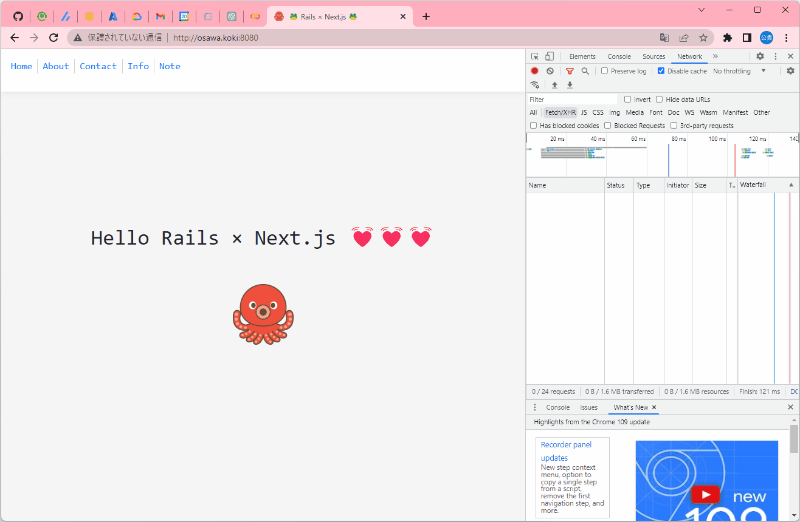

# rails-nextjs-template

🍶🍶🍶 Ruby on RailsとNext.jsによるWebアプリケーションテンプレート。  

  

## 実行方法

```shell
docker compose up db -d [--build]
docker compose up api -d [--build]
docker compose up web -d [--build]
```

---

APIコントローラを追加するには、以下のコマンドを実行。  

```shell
rails generate controller Api::V1::<API名>
# docker-compose run api rails generate controller Api::V1::<API名>
```

`routes.rb`でURLマッピングをし、`app/controllers`に作成されたファイルに実装する。  
